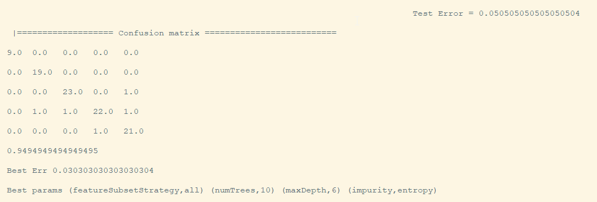

# CS5542-ICP-10

For ICP10 the tasks are:
1. Perform the Random Forest model and KMeans clustering for classification on a sample of the categorized Flickr8k dataset
2. Show the accuracy and the Confusion Matrix

## Overview

The categories used are:

* forest
* hill
* lake
* mountain
* ocean

For the Random Forest model, 10 trees were generated

## Results

Accuracy is: 0.9494949494949495

Confusion Matrix:

## Source Code

The source code for this ICP was provided by the class instructor Mayanka ChandraShekar: [mckw9@mail.umkc.edu](https://github.com/djyuhn/CS5560-ICP/blob/master/KDM-ICP7/mckw9@mail.umkc.edu)
