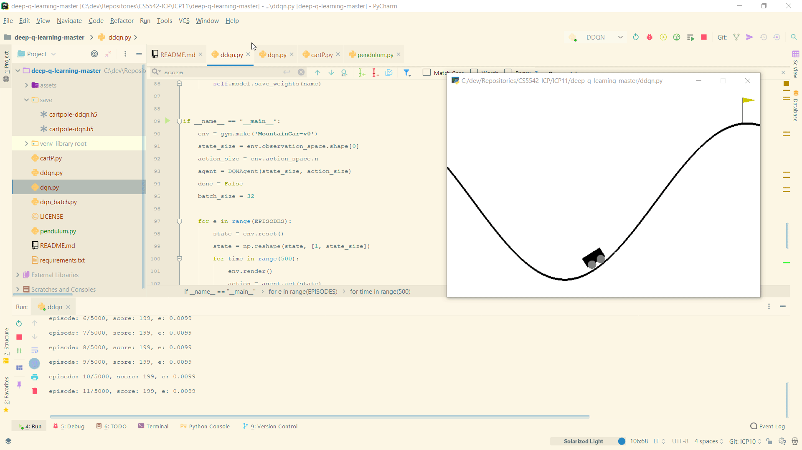

# CS5542-ICP-11

For ICP11 the tasks are:
1. Change the code to work with another environment  in Gym

## Results

## Source Code

The source code for this ICP was provided by the class instructor Mayanka ChandraShekar: [mckw9@mail.umkc.edu](https://github.com/djyuhn/CS5560-ICP/blob/master/KDM-ICP7/mckw9@mail.umkc.edu)
