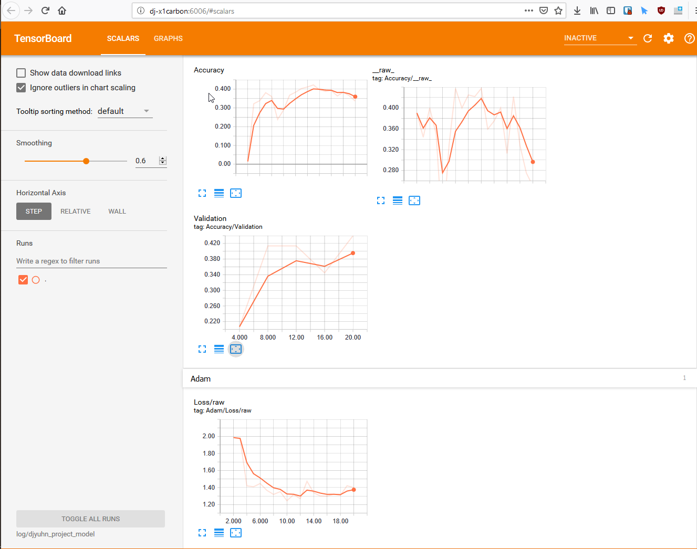

# CS5542-ICP-5
For ICP5 the task is to write a Tensor Flow program with the following tasks:

1. Retrain Inception Model final layer for Image Dataset and report accuracy
2. Visualizations (Tensor Board) of training, loss, weights, and validation


## Overview

This ICP was conducted on a subset of the images pertaining to my project on Terrain and Structures.

The subset includes categories of: building, city, hill, and lake.


## Results

### Retrain Inception Model

The retrain inception model final layer's report accuracy for the dataset.

```
2019-02-21 18:30:06.147363: Step 0: Train accuracy = 38.0%
2019-02-21 18:30:06.147363: Step 0: Cross entropy = 1.300041
2019-02-21 18:30:10.895145: Step 0: Validation accuracy = 21.0% (N=100)
2019-02-21 18:30:12.690060: Step 10: Train accuracy = 100.0%
2019-02-21 18:30:12.690060: Step 10: Cross entropy = 0.901502
2019-02-21 18:30:12.794085: Step 10: Validation accuracy = 69.0% (N=100)
2019-02-21 18:30:14.013291: Step 20: Train accuracy = 96.0%
2019-02-21 18:30:14.013291: Step 20: Cross entropy = 0.677105
2019-02-21 18:30:14.113666: Step 20: Validation accuracy = 61.0% (N=100)
2019-02-21 18:30:15.354557: Step 30: Train accuracy = 99.0%
2019-02-21 18:30:15.354557: Step 30: Cross entropy = 0.516018
2019-02-21 18:30:15.478153: Step 30: Validation accuracy = 64.0% (N=100)
2019-02-21 18:30:16.866537: Step 40: Train accuracy = 100.0%
2019-02-21 18:30:16.866537: Step 40: Cross entropy = 0.421342
2019-02-21 18:30:16.968610: Step 40: Validation accuracy = 59.0% (N=100)
2019-02-21 18:30:18.197017: Step 50: Train accuracy = 100.0%
2019-02-21 18:30:18.197017: Step 50: Cross entropy = 0.341883
2019-02-21 18:30:18.308088: Step 50: Validation accuracy = 67.0% (N=100)
2019-02-21 18:30:19.840475: Step 60: Train accuracy = 100.0%
2019-02-21 18:30:19.840475: Step 60: Cross entropy = 0.290184
2019-02-21 18:30:20.037501: Step 60: Validation accuracy = 85.0% (N=100)
2019-02-21 18:30:21.287936: Step 70: Train accuracy = 100.0%
2019-02-21 18:30:21.287936: Step 70: Cross entropy = 0.249571
2019-02-21 18:30:21.402889: Step 70: Validation accuracy = 81.0% (N=100)
2019-02-21 18:30:22.531992: Step 80: Train accuracy = 100.0%
2019-02-21 18:30:22.531992: Step 80: Cross entropy = 0.229807
2019-02-21 18:30:22.672400: Step 80: Validation accuracy = 63.0% (N=100)
2019-02-21 18:30:24.047150: Step 90: Train accuracy = 100.0%
2019-02-21 18:30:24.047150: Step 90: Cross entropy = 0.197100
2019-02-21 18:30:24.172471: Step 90: Validation accuracy = 88.0% (N=100)
2019-02-21 18:30:25.265147: Step 100: Train accuracy = 100.0%
2019-02-21 18:30:25.265147: Step 100: Cross entropy = 0.206483
2019-02-21 18:30:25.363765: Step 100: Validation accuracy = 82.0% (N=100)
2019-02-21 18:30:26.518019: Step 110: Train accuracy = 100.0%
2019-02-21 18:30:26.518019: Step 110: Cross entropy = 0.167177
2019-02-21 18:30:26.624165: Step 110: Validation accuracy = 83.0% (N=100)
2019-02-21 18:30:27.966831: Step 120: Train accuracy = 100.0%
2019-02-21 18:30:27.966831: Step 120: Cross entropy = 0.147602
2019-02-21 18:30:28.099017: Step 120: Validation accuracy = 66.0% (N=100)
2019-02-21 18:30:29.256601: Step 130: Train accuracy = 100.0%
2019-02-21 18:30:29.256601: Step 130: Cross entropy = 0.128813
2019-02-21 18:30:29.363823: Step 130: Validation accuracy = 82.0% (N=100)
2019-02-21 18:30:30.423161: Step 140: Train accuracy = 100.0%
2019-02-21 18:30:30.423161: Step 140: Cross entropy = 0.142238
2019-02-21 18:30:30.530727: Step 140: Validation accuracy = 75.0% (N=100)
2019-02-21 18:30:31.723259: Step 150: Train accuracy = 100.0%
2019-02-21 18:30:31.723259: Step 150: Cross entropy = 0.132657
2019-02-21 18:30:31.849896: Step 150: Validation accuracy = 79.0% (N=100)
2019-02-21 18:30:34.223622: Step 160: Train accuracy = 100.0%
2019-02-21 18:30:34.223622: Step 160: Cross entropy = 0.111136
2019-02-21 18:30:34.415032: Step 160: Validation accuracy = 77.0% (N=100)
2019-02-21 18:30:37.382024: Step 170: Train accuracy = 100.0%
2019-02-21 18:30:37.382024: Step 170: Cross entropy = 0.104795
2019-02-21 18:30:37.502077: Step 170: Validation accuracy = 81.0% (N=100)
2019-02-21 18:30:38.697452: Step 180: Train accuracy = 100.0%
2019-02-21 18:30:38.697452: Step 180: Cross entropy = 0.100604
2019-02-21 18:30:38.808231: Step 180: Validation accuracy = 81.0% (N=100)
2019-02-21 18:30:39.928104: Step 190: Train accuracy = 100.0%
2019-02-21 18:30:39.928104: Step 190: Cross entropy = 0.095386
2019-02-21 18:30:40.030059: Step 190: Validation accuracy = 70.0% (N=100)
2019-02-21 18:30:41.076136: Step 199: Train accuracy = 100.0%
2019-02-21 18:30:41.076136: Step 199: Cross entropy = 0.087654
2019-02-21 18:30:41.180858: Step 199: Validation accuracy = 78.0% (N=100)
Final validation accuracy = 55.0% (N=40)
```


### ClassificationCNN


## Tensorboard

### Retrain Inception Model

### 


### ClassificationCNN

### 





## Source Code

The source code for this ICP was provided by the class instructor Mayanka ChandraShekar: [mckw9@mail.umkc.edu](https://github.com/djyuhn/CS5560-ICP/blob/master/KDM-ICP7/mckw9@mail.umkc.edu)

