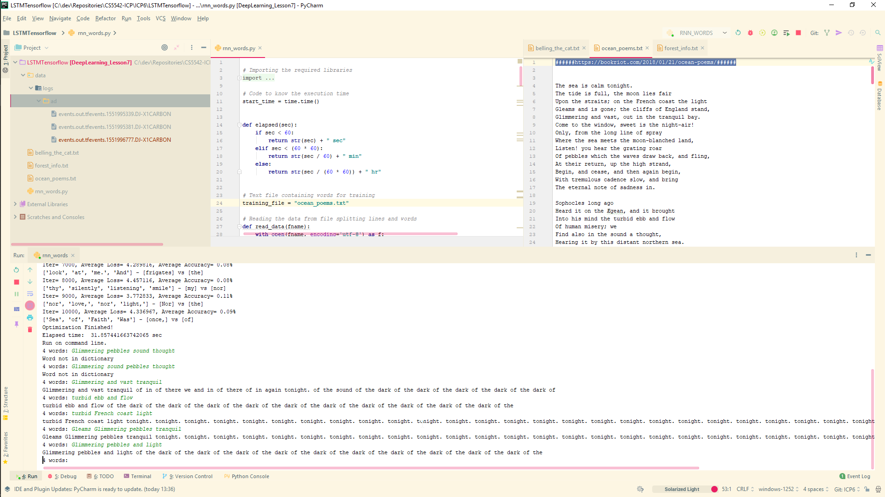

# CS5542-ICP-6
For ICP6 the task is to train a LSTM and to use an existing model for Image Caption generation using TensorFlow

## Results

## Source Code

The source code for this ICP was provided by the class instructor Mayanka ChandraShekar: [mckw9@mail.umkc.edu](https://github.com/djyuhn/CS5560-ICP/blob/master/KDM-ICP7/mckw9@mail.umkc.edu)

