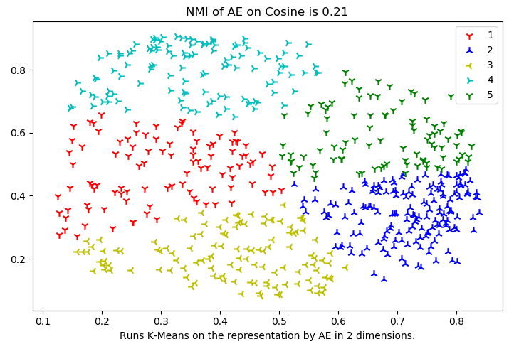

# CS5542-ICP-6

For ICP8 the tasks are:
1. Increase the number of 20 News group dataset categories to 5 
2. Perform dimensionality reduction using Deep Autoencoders
3. Finally Apply K-means clustering and visualize the groups
4. Try experimenting with different hyper-parameters to train a LSTM and to use an existing model for Image Caption generation using TensorFlow

## Process

Two additional newsgroup categories (sci.electronics, sci.space) were added for a total of five.

The same hyperparameters were used for the original run, just on 5 categories instead of the three.

In the next set, the target value from the dataset was increased from 600 to 1200 and the stop learning rate was increased to 1.8. This was done using the TFIDFVectorizer

Another set used the CountVectorizer for the vectorizing of text. The target from the data set remained at 1200, and the learning rate remained at 1.8.

## Results

### 5 Categories Unchanged Hyperparameter Results

### 5 Categories TFIDFVectorizer: Target 1200, Learning Rate 1.8

### 5 Categories CountVectorizer: Target 1200, Learning Rate 1.8

## Source Code

The source code for this ICP was provided by the class instructor Mayanka ChandraShekar: [mckw9@mail.umkc.edu](https://github.com/djyuhn/CS5560-ICP/blob/master/KDM-ICP7/mckw9@mail.umkc.edu)
