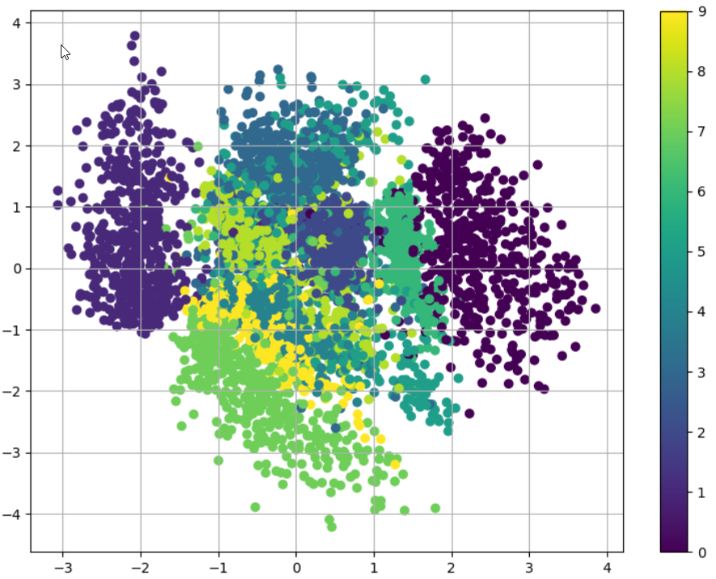

# CS5542-ICP-9

For ICP9 the tasks are:
1. Change the network structure
2. Try experimenting with different hyper-parameters
3. Plot the reconstruction loss using matplotlib
4. Visualize the 2d latent space using matplotlib

## Overview

The process consisted of adjusting the epochs from 50 to 5, as well as the neurons from 500 to 200 for each layer, while introducing additional hidden layers: 1 recognition and 1 generational.

## Results

### 5 Epochs, 500 neurons, 2 recognition/generational layers

### 50 Epochs, 500 neurons, 2 recognition/generational layers

### 10 Epochs, 200 neurons, 3 recognition/generational layers

## Source Code

The source code for this ICP was provided by the class instructor Mayanka ChandraShekar: [mckw9@mail.umkc.edu](https://github.com/djyuhn/CS5560-ICP/blob/master/KDM-ICP7/mckw9@mail.umkc.edu)
